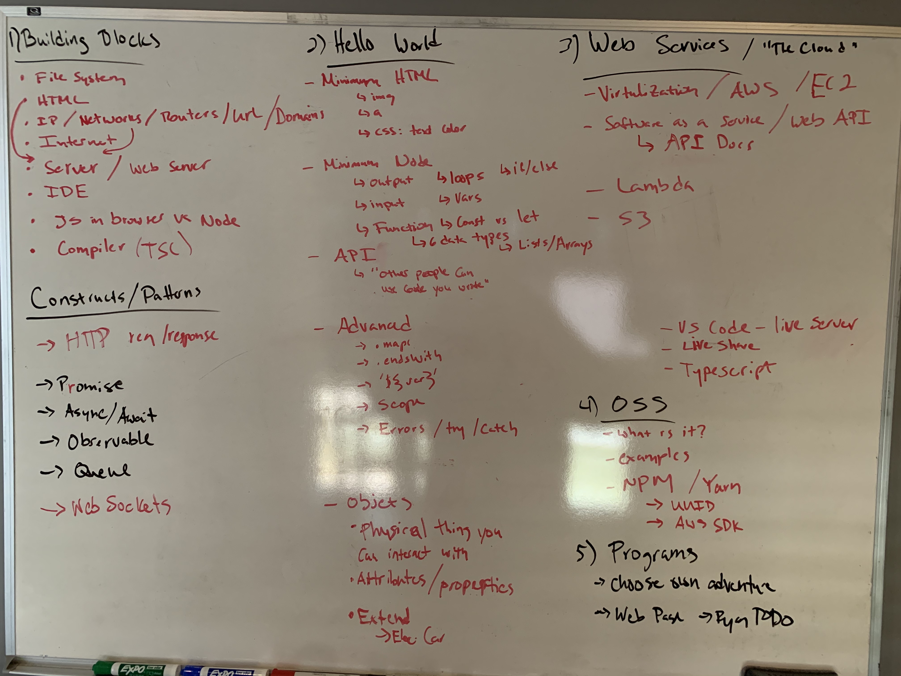
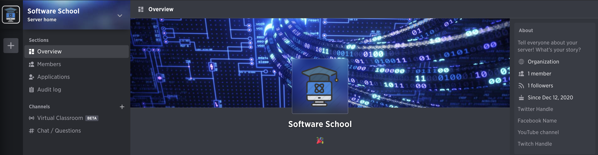

# software-school
Teaching software and internet basics to kids. Targeted towards 8YO+

Throughout this project you'll see this:
> Help needed:

Which means I could use help from the community in the form of GitHub pull requests (PR) to make this project better.

Here is how it all started ;)



## Prerequisites

Before getting started, there are some steps the teacher and each student will need to do.

> Help needed: this school is setup for mac (and linux sort-of) computers. PR welcome for adding windows support.

### Prereq's for teacher

- Slides are [here](https://docs.google.com/presentation/d/1ZBV382xmKHYd6rEfKVmPTAwuuC0Ok2Nsl5CspRlGBlA/edit?usp=sharing) (bookmark it!)
- Github account

#### Collaboration

##### Chat

Setup a place to collaborate (even if doing this in person). You'll need a place to share links (like VS Code "live share" extension, mentioned below). I recommend [guilded.gg](https://www.guilded.gg) (full transparency: this is where I work. `rynop/software-school` is no way affiliated).  Slack, MS Teams, etc will all work as well.  Here is my Guilded setup:


##### Live/paired coding 

I recommend using VS Code ["Live share" extension](https://marketplace.visualstudio.com/items?itemName=MS-vsliveshare.vsliveshare-pack) to view/edit  student's code right in their IDE (VS Code).  Set it up ahead of time (I'll install it for you below).  You will sign into the extension with your github account (unless each student has their own github account).  See the [live share docs](https://docs.microsoft.com/en-us/visualstudio/liveshare/) for more info on how to use this extension.

#### Setup each computer (teacher and each student)

- Install [VS Code](https://code.visualstudio.com) IDE.  You can use [my VS code preferences](./prereqs/vscode-prefs.json) if you like (⇧+⌘+P then `Preferences: Open Settings (JSON)`).
- Put `code` command on your path: ⇧+⌘+P then `Shell Command: Install 'code' command in PATH`
- Install VS code extensions via (make sure to restart your terminal after putting `code` on your PATH):
```
code --install-extension esbenp.prettier-vscode
code --install-extension jgoday.createtmpfile
code --install-extension ms-vsliveshare.vsliveshare
code --install-extension ritwickdey.LiveServer
```
> Note: I use the [LiveServer extension](https://marketplace.visualstudio.com/items?itemName=ritwickdey.LiveServer) here so students can have a web server built into the IDE that auto-refreshes when the file is changed.
- Clone this repo to `~/` (your home directory)
- [Install nodejs](https://nodejs.org/tr/download/package-manager)
- [Install yarn](https://classic.yarnpkg.com/en/docs/install/#mac-stable)


### Prereq's for each student

- 

## Extra credit: AWS

In lession 5, I touch on "the cloud".  At the end of this lesson I walk students through how to deploy the webpage they made "to the cloud".  This requires an AWS account AND basic knowledge (this is an entire curriculum on its own).

You have a couple options for setting up an AWS account:

1. Create an AWS account. You get [lots of stuff for free, for 12 months](https://aws.amazon.com/free/?all-free-tier.sort-by=item.additionalFields.SortRank&all-free-tier.sort-order=asc). Including 5 GB of S3 storage (what I use in the lesson). This is the quickest way to get up and running. After 12mo, its only $0.02/mo per 1 GB of storage.

1. If you are a certified and active teacher, you can apply for [AWS Educate](https://aws.amazon.com/education/awseducate/).  I don't have a teaching degree, and have never went through this process so I'm not sure how painful it is or what exactly you get.  I do know that it mentions you get some AWS credits..

### AWS Setup

Once you have an AWS account, [create an S3 bucket](https://docs.aws.amazon.com/AmazonS3/latest/dev/HowDoIWebsiteConfiguration.html) via the web console, make sure to allow public access.

1. Go into [IAM console](https://console.aws.amazon.com/iam/home) and make a user that your students will use to upload their files to your bucket.
    1. Hit "Add user", enter a name, select "Programmatic access" only
    1. Click "Create group", enter a name and hit "Create Group".  Keep hitting next to create user.
    1. Copy Access key and secret somplace safe. You are going to use it on each of your students computers
    1. Back on the IAM dashboard, click groups and click on the name of the group you made
    1. Click "Permissions" tab, then hit "Inline Policies" then hit "Create Group Policy" and paste this in (make sure to update your bucket name):
```json
{
  "Version": "2012-10-17",
  "Statement": [
    {
      "Sid": "Stmt1608320799000",
      "Effect": "Allow",
      "Action": [
        "s3:DeleteObject",
        "s3:G*",
        "s3:List*",
        "s3:Put*"
      ],
      "Resource": [
        "arn:aws:s3:::<bucket-name>",
        "arn:aws:s3:::<bucket-name>/*"
      ]
    }
  ]
}
```

On each of your students computers, [install the AWS CLI](https://docs.aws.amazon.com/cli/latest/userguide/install-cliv2.html), then make these files:

```bash
# ~/.aws/config:

[default]
region = <your aws account region. Ex: us-east-1>
cli_pager=

# ~/.aws/credentials:

[default]
aws_access_key_id = <copied key>
aws_secret_access_key = <copied secret>
```

Make sure it works from their computer by running:

```bash
aws s3 ls s3://<bucket-name>
# If no error, you are good!
```
